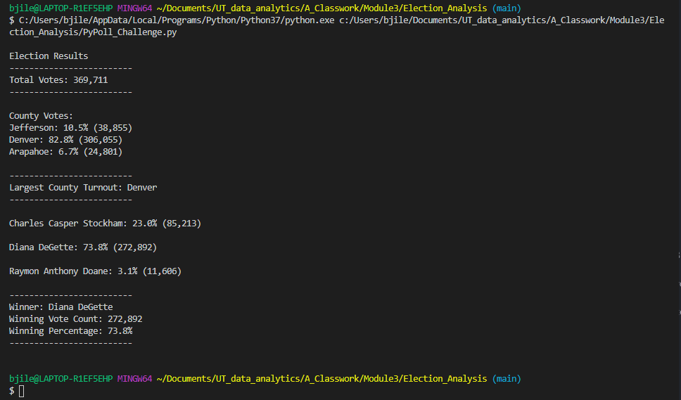
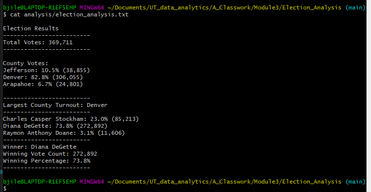

# Election_Analysis

## Project Overview
A Colorado Board of Elections employee has given you the following tasks to complete the election audit of a recent local congressional election.

1. Calculate the total number of votes cast.
2. Get a complete list of candidates who received votes.
3. Calculate the total number of votes each candidate received.
4. Calculate the percentage of votes each candidate won.
5. Determine the winner of the election based on popular vote.

The election commission has also requested some additional data to complete the audit:

6. Calculate the voter turnout for each county
7. Calculate the percentage of votes from each county out of the total count
8. Determine the county with the highest turnout

## Resources
- Data Source: Resources/election_results.csv
- Software: Python 3.7.6, Visual Studio Code 1.54.3

## Election Audit Results
The analysis of the election shows that:
- There were 369,711 votes cast in the election.

- The counties that participated in the election:
  - Jefferson
  - Denver
  - Arapahoe

- The county results:
  - Jefferson County cast 10.5% of the turnout with 38,855 votes
  - Denver County cast 82.8% of the vote with 306,055 votes
  - Arapahoe County cast 6.7% of the vote with 24,801 votes
  - The county with the highest turnout was Denver County
- The candidates:
  - Charles Casper Stockham
  - Diana DeGette
  - Raymon Anthony Doane
- The candidate results:
  - Charles Casper Stockham received 23.0% of the vote and 85,213 votes
  - Diana DeGette received 73.8% of the vote and 272,892 votes
  - Raymon Anthony Doane received 3.1% of the vote and 11,606 votes
- The winner of the election was:
  - Diana DeGette, who received 73.8% of the vote and 272,892 votes

## Election Audit Summary
Our script can be for any election by the following features:
1. Provide columns in the CSV file for Precincts (within counties) and States.
2. Add additional code to tabulate results by Precinct and State
With those modifications, our script could be used for any US election.

Also note that some states use the term Parrish instead of County (e.g. Louisiana), so maybe another modification would be useful

3. Use the header fields to determine whether the column should be called Parrish or County

Our Python script produced the following output to the command line:

Our Python script produced the following output into a text file:

